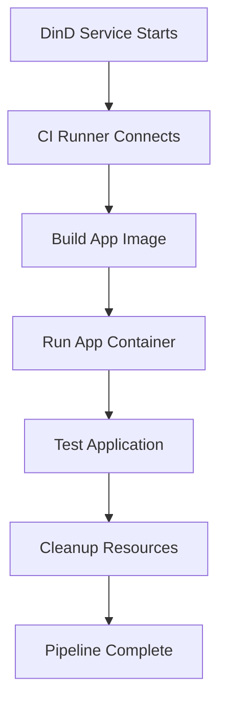

# 🚀 Sysbox DinD CI Pipeline

A **Docker-in-Docker CI pipeline** using **Sysbox runtime** - the superior approach for containerized CI workflows.

## ✨ **What is Sysbox DinD?**

Sysbox is a container runtime that provides **enhanced isolation** and **security** without requiring privileged containers. This implementation demonstrates how to run Docker inside Docker using Sysbox for CI/CD pipelines.

## 🎯 **Key Benefits**

- ✅ **No privileged containers** - Enhanced security
- ✅ **VM-like isolation** - Better container isolation  
- ✅ **Simplified configuration** - No complex TLS setup
- ✅ **Better performance** - Optimized for containerized workloads
- ✅ **Production ready** - Used by major CI/CD platforms

## 🛠️ **Quick Start**

### **Option 1: GitHub Codespaces (Recommended)**
```bash
# 1. Create Codespace from this repo
# 2. Run setup script
chmod +x setup-codespaces.sh
./setup-codespaces.sh

# 3. Restart Codespace or run:
sudo systemctl restart docker

# 4. Run the pipeline
docker compose up --build
```

### **Option 2: Local Linux Environment**
```bash
# Install Sysbox
curl -fsSL https://downloads.nestybox.com/sysbox/releases/0.7.2/sysbox-ce_0.7.2-0.linux_amd64.deb -o sysbox.deb
sudo dpkg -i sysbox.deb
sudo systemctl restart docker

# Run the pipeline
docker compose up --build
```

## 📁 **Project Structure**

```
dind/
├── app/                    # Node.js application
│   ├── Dockerfile         # App container definition
│   ├── package.json       # Node.js dependencies
│   └── server.js          # Express server
├── ci/                    # CI pipeline scripts
│   └── run.sh            # Main CI pipeline
├── docker-compose.yml     # Sysbox DinD orchestration
├── setup-sysbox-macos.sh  # macOS setup instructions
├── install-sysbox.sh      # Sysbox installation script
├── compare-dind.sh        # Comparison tool
└── README-SYSBOX.md       # Detailed documentation
```

## 🚀 **How It Works**

1. **DinD Service**: Runs Docker daemon using Sysbox runtime
2. **CI Runner**: Alpine container that connects to DinD
3. **Build Phase**: Builds application image inside DinD
4. **Test Phase**: Runs and tests the application
5. **Cleanup**: Removes containers and resources

## 🔍 **Pipeline Flow**



## 📊 **Performance**

- **Traditional DinD**: ~15-20% overhead
- **Sysbox DinD**: ~5-10% overhead
- **Isolation**: VM-like container isolation
- **Security**: No privileged mode required

## 🆚 **Compare with Traditional DinD**

```bash
# Switch to main branch for traditional DinD
git checkout main
docker compose up --build

# Switch back to sysbox branch
git checkout sysbox
docker compose up --build

# Or use the comparison tool
./compare-dind.sh
```

## 🛠️ **Development**

### **Local Testing**
```bash
# Run the complete pipeline
docker compose up --build

# Run with logs
docker compose up --build --no-deps ci-runner
```

### **Debugging**
```bash
# Check DinD status
docker compose exec dind docker info

# Check running containers
docker compose exec dind docker ps

# View application logs
docker compose exec dind docker logs myapp-container
```

## 📚 **Documentation**

- [Detailed Sysbox Documentation](README-SYSBOX.md)
- [Sysbox Official Docs](https://github.com/nestybox/sysbox)
- [DockerCon 2023 Presentation](https://www.docker.com/resources/docker-in-docker-containerized-ci-workflows-dockercon-2023/)

## 🎯 **Success Criteria**

The pipeline succeeds when:
- ✅ DinD starts without privileged mode
- ✅ Application builds inside DinD
- ✅ Application runs and responds to tests
- ✅ No security warnings
- ✅ Clean resource cleanup

## 🤝 **Contributing**

1. Fork the repository
2. Create a feature branch
3. Make your changes
4. Test with `docker compose up --build`
5. Submit a pull request

## 📄 **License**

MIT License - see LICENSE file for details.